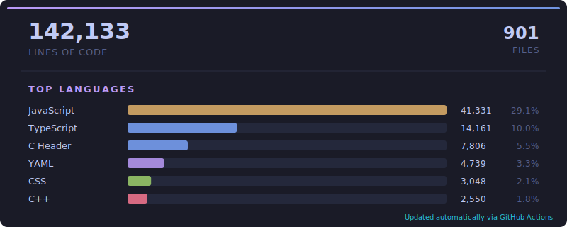
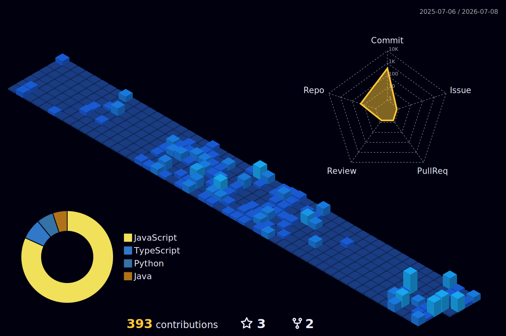

<div align="center">
  
</div>

<div align="center">
  <h1 align="center">Hi  I'm Harsh Kumar</h1>
  
  [](https://git.io/typing-svg)
  
  <div>
    
  </div>

  
  <div style="margin-top: 20px;">
    <a href="https://www.linkedin.com/in/harshkumaragrawal/"></a>
    <a href="https://x.com/harshkragrl"></a>
    <a href="https://instagram.com/agrl_harsh/"></a>
    <a href="mailto:harshkr.agrl@gmail.com"></a>
  </div>
  <br>
  <a href="https://www.thegitcity.com/dev/harshagrl">
    
  </a>
</div>

<br>

## &nbsp; About Me

<div style="display: flex;">

    <div>
  
```typescript
// AboutMe.ts
export class Developer {
  name: string = "Harsh Kumar";
  education: string = "Final Year Engineering Student";
  location: string = "India";
  
  // Core Skills
  languages: string[] = ["C++", "Java", "Python", "SQL", "JavaScript"];
  specialization: string[] = ["MERN Stack", "GEN AI", "DevOps", "Cloud Computing"];
  currentFocus: string = "Seeking Web Development Internships/Jobs & building scalable apps";
  
  // Fun Facts
  usesOS: string = "Kali Linux";
  favoriteBeverage: string = "Coffee while coding 🍵";
  motto: string = "If life gives you bugs, deploy a hotfix!";
  
  // Contact
  email: string = "harshkr.agrl@gmail.com";
  
  greet(): string {
    return "Thanks for visiting my digital space! Let's build something amazing.";
  }
}
```
  </div>
</div>
<br>
<div align="left">
  <h2>&nbsp; GitHub Stats</h2>
    <br>
    <a href="https://github-trophies.vercel.app/?username=harshagrl" target="_blank">
      
    </a>
</div>

<br>
<div align="center">
  

  <br>
  <a href="https://github-contributor-stats.vercel.app/api?username=harshagrl&limit=3&theme=tokyonight&combine_all_yearly_contributions=true">
  
  <br>
  
  

<div align="center">

</div>


  <div style="display: flex; justify-content: center; flex-wrap: wrap; gap: 20px;">
    <div style="display: flex; justify-content: center; flex-wrap: wrap; gap: 20px;">
    </div>
  </div>
</div>
  
<br>


<br>

## &nbsp; Technologies & Tools

<div align="center">
  <a href="#"></a>
  <a href="#"></a>
  <a href="#"></a>
  <a href="#"></a>
  <a href="#"></a>
  <a href="#"></a>
  <a href="#"></a>
  <a href="#"></a>
  <a href="#"></a>
  <a href="#"></a>
  <a href="#"></a>
  <a href="#"></a>
  <a href="#"></a>
  <a href="#"></a>
  <a href="#"></a>
  <a href="#"></a>
  <a href="#"></a>
  <a href="#"></a>
  <a href="#"></a>
  <a href="#"></a>
  <a href="#"></a>
  <a href="#"></a>
  <a href="#"></a>
  <a href="#"></a>
  <a href="#"></a>
  <a href="#"></a>
  <a href="#"></a>
  <a href="#"></a>
  <a href="#"></a>
  <a href="#"></a>
  <a href="#"></a>
  <a href="#"></a>
  <a href="#"></a>
  <a href="#"></a>
  <a href="#"></a>
  <a href="#"></a>
  <a href="#"></a>
  <a href="#"></a>
  <a href="#"></a>
  <a href="#"></a>
  <a href="#"></a>
  <a href="#"></a>
  <a href="#"></a>
  <a href="#"></a>
  <a href="#"></a>
  <a href="#"></a>
  <a href="#"></a>
  <a href="#"></a>
  <a href="#"></a>
  <a href="#"></a>
  <a href="#"></a>
  <a href="#"></a>
  <a href="#"></a>
  <a href="#"></a>
  <a href="#"></a>
  <a href="#"></a>
  <a href="#"></a>
  <a href="#"></a>
  <a href="#"></a>
  <a href="#"></a>
  <a href="#"></a>
  <a href="#"></a>
  <a href="#"></a>
  <a href="#"></a>
  <a href="#"></a>
  <a href="#"></a>
  <a href="#"></a>
  <a href="#"></a>
  <a href="#"></a>
</div>

<br>


<div align="center">
  <h2>SKILL MATRIX</h2>
  
  <div align="center" style="display: flex; flex-wrap: wrap; justify-content: center; gap: 20px;">
    <div align="center">
      <table>
        <tr>
          <td align="center" width="100">
            <a href="#">
              
            </a>
            <br>JavaScript
          </td>
          <td align="center" width="100">
            <a href="#">
              
            </a>
            <br>TypeScript
          </td>
          <td align="center" width="100">
            <a href="#">
              
            </a>
            <br>Python
          </td>
          <td align="center" width="100">
            <a href="#">
              
            </a>
            <br>Java
          </td>
          <td align="center" width="100">
            <a href="#">
              
            </a>
            <br>C++
          </td>
        </tr>
        <tr>
          <td align="center" width="100">
            <a href="#">
              
            </a>
            <br>React
          </td>
          <td align="center" width="100">
            <a href="#">
              
            </a>
            <br>Redux
          </td>
          <td align="center" width="100">
            <a href="#">
              
            </a>
            <br>Node.js
          </td>
          <td align="center" width="100">
            <a href="#">
              
            </a>
            <br>Webpack
          </td>
          <td align="center" width="100">
            <a href="#">
              
            </a>
            <br>MySQL
          </td>
        </tr>
        <tr>
          <td align="center" width="100">
            <a href="#">
              
            </a>
            <br>AWS
          </td>
          <td align="center" width="100">
            <a href="#">
              
            </a>
            <br>Docker
          </td>
          <td align="center" width="100">
            <a href="#">
              
            </a>
            <br>GitHub
          </td>
          <td align="center" width="100">
            <a href="#">
              
            </a>
            <br>MongoDB
          </td>
          <td align="center" width="100">
            <a href="#">
              
            </a>
            <br>Nginx
          </td>
        </tr>
      </table>
    </div>
  </div>
</div>

<div align="center">
  <h3>Proficiency Level</h3>
</div>

<div align="center">
  <table>
    <tr>
      <td>
        
      </td>
      <td>
        
      </td>
    </tr>
    <tr>
      <td>
        
      </td>
      <td>
        
      </td>
    </tr>
    <tr>
      <td>
        
      </td>
      <td>
        
      </td>
    </tr>
  </table>
</div>


<br>

## &nbsp; Let's Connect!

<div align="center">
  <a href="https://x.com/harshkragrl" target="_blank">
    
  </a>
  <a href="https://www.linkedin.com/in/harshkumaragrawal/" target="_blank">
    
  </a>
  <a href="https://instagram.com/agrl_harsh/" target="_blank">
    
  </a>
  <a href="https://www.hackerrank.com/profile/harshkr_agrl" target="_blank">
    
  </a>
  <a href="https://leetcode.com/u/harshagrl/" target="_blank">
    
  </a>
</div>

<br>

<div align="center">
  <a href="#">
    
  </a>
</div>
<br>

<div align="center">
  <picture> <source media="(prefers-color-scheme: dark)" srcset="https://raw.githubusercontent.com/akki120781/akki120781/output/pacman-contribution-graph-dark.svg"> <source media="(prefers-color-scheme: light)" srcset="https://raw.githubusercontent.com/akki120781/akki120781/output/pacman-contribution-graph.svg">  
  </picture>
</div>

<div align="left">
    <h2>&nbsp; 3D Contribution Graph</h2>
</div>
<div align="center">
  
</div>
<br>
<div align="center">


</div>
